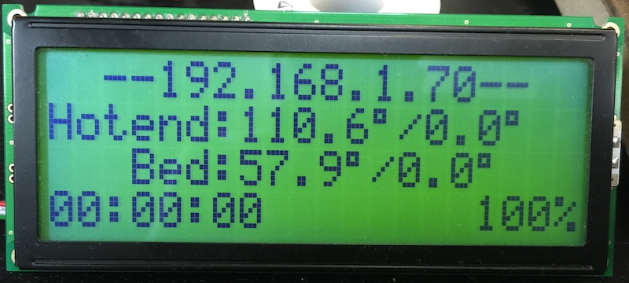

# OctoPiCharLCD
Show OctoPrint status on a character LCD display

This app will show some status info for OctoPrint on a 20x4 character LCD display. The LCD display is connected to Raspberry Pi GPIO pins and the data is pulled from the OctoPrint API.

##Installation
ssh into your Octoprint machine as the 'pi' user

Install required packages
```
sudo apt-get install build-essential python-dev python-smbus python-pip git
sudo pip install rpi.gpio
sudo pip install requests
```

Clone the repository
```
cd /home/pi
sudo git clone https://github.com/matt448/OctoPiCharLCD.git
```

Create symbolic links for startup scripts
```
sudo ln -s /home/pi/OctoPiCharLCD/octolcd.py /usr/bin/octolcd
sudo ln -s /home/pi/OctoPiCharLCD/etc/init.d/octolcd /etc/init.d/octolcd
```

Start up the service
```
sudo service octolcd start
```

##Screenshot


##LCD Wiring

LCD Pin # | LCD Pin Desc | Connection
:---------: |------------|-----------
1         | GND          | Ground
2         | 5V           | 5V
3         | Contrast     | Center pin 10k pot
4         | RS           | RPi GPIO #25
5         | R/W          | Ground
6         | EN           | RPi GPIO #24
7         | Data Bit 0   | NOT USED N/C
8         | Data Bit 1   | NOT USED N/C
9         | Data Bit 2   | NOT USED N/C
10        | Data Bit 3   | NOT USED N/C
11        | Data Bit 4   | RPi GPIO #23
12        | Data Bit 5   | RPi GPIO #17
13        | Data Bit 6   | RPi GPIO #21
14        | Data Bit 7   | RPi GPIO #22
15        | LCD Backlight +5v   | 5V
16        | LCD Backlight GND | Ground
